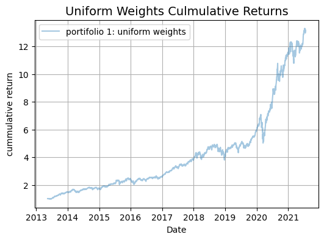
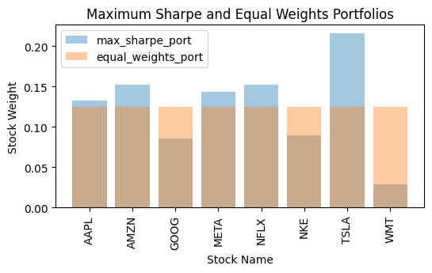
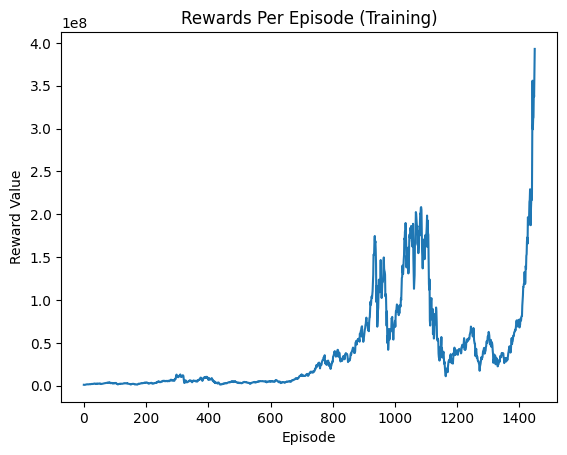
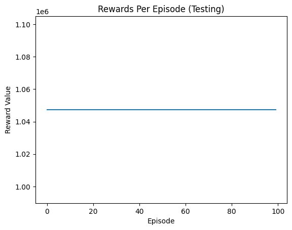
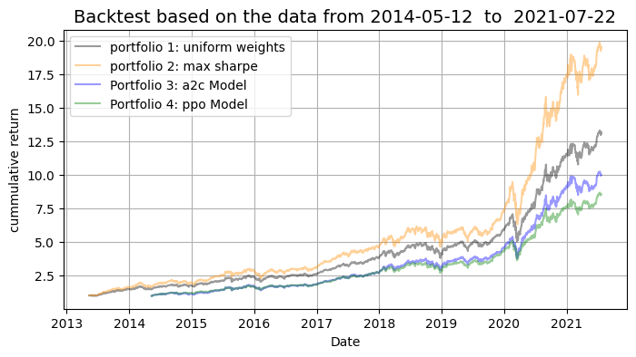
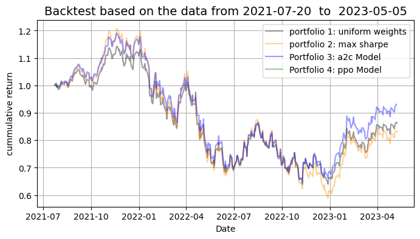

```python
import pandas as pd
import numpy as np
import ta
from ta import add_all_ta_features
from ta.utils import dropna
from utils import data_split, add_cov_matrix, get_portfolio_variance, get_annualized_return
from bs4 import BeautifulSoup
import yfinance as yf
import re
import json
import gym
from gym import spaces
import matplotlib.pyplot as plt

from IPython.display import display, HTML
from datetime import datetime
from stable_baselines3.common.vec_env import DummyVecEnv

from pypfopt.efficient_frontier import EfficientFrontier
from pypfopt import objective_functions
from pypfopt import risk_models
from pypfopt import expected_returns
import warnings
warnings.filterwarnings('ignore')
```

## Data gathering and pre-processing

```python
ticker = ['AAPL', 'AMZN', 'META', 'NFLX', 'GOOG', 'TSLA', 'NKE', 'WMT']
dataNeededArr = ['Open','Low','High','Close','Volume']
df = pd.DataFrame()
for t in ticker:
  GetStockData = yf.Ticker(t)
  StockData = pd.DataFrame()

  StockData["Date"] = GetStockData.history(period="10y").index
  for col in dataNeededArr:
    StockData[col] = GetStockData.history(period="10y")[col].values
  StockData['Ticker'] = t
  print(StockData.shape[0])
  df= pd.concat([df, StockData], ignore_index=True)
```

    2517
    2517
    2517
    2517
    2517
    2517
    2517
    2517

```python
df['Date'] = pd.to_datetime(df['Date'])
df['Date'] = df['Date'].dt.date
```

```python
df
```

<div>
<style scoped>
    .dataframe tbody tr th:only-of-type {
        vertical-align: middle;
    }

    .dataframe tbody tr th {
        vertical-align: top;
    }

    .dataframe thead th {
        text-align: right;
    }

</style>
<table border="1"  >
  <thead>
    <tr style="text-align: right;">
      <th></th>
      <th>Date</th>
      <th>Open</th>
      <th>Low</th>
      <th>High</th>
      <th>Close</th>
      <th>Volume</th>
      <th>Ticker</th>
    </tr>
  </thead>
  <tbody>
    <tr>
      <th>0</th>
      <td>2013-05-10</td>
      <td>14.219935</td>
      <td>13.987371</td>
      <td>14.273961</td>
      <td>14.064684</td>
      <td>334852000</td>
      <td>AAPL</td>
    </tr>
    <tr>
      <th>1</th>
      <td>2013-05-13</td>
      <td>14.019352</td>
      <td>14.019043</td>
      <td>14.217760</td>
      <td>14.119644</td>
      <td>316948800</td>
      <td>AAPL</td>
    </tr>
    <tr>
      <th>2</th>
      <td>2013-05-14</td>
      <td>14.092008</td>
      <td>13.728724</td>
      <td>14.133927</td>
      <td>13.781822</td>
      <td>447118000</td>
      <td>AAPL</td>
    </tr>
    <tr>
      <th>3</th>
      <td>2013-05-15</td>
      <td>13.635885</td>
      <td>13.114245</td>
      <td>13.693016</td>
      <td>13.315763</td>
      <td>741613600</td>
      <td>AAPL</td>
    </tr>
    <tr>
      <th>4</th>
      <td>2013-05-16</td>
      <td>13.141572</td>
      <td>13.006814</td>
      <td>13.595207</td>
      <td>13.493677</td>
      <td>603204000</td>
      <td>AAPL</td>
    </tr>
    <tr>
      <th>...</th>
      <td>...</td>
      <td>...</td>
      <td>...</td>
      <td>...</td>
      <td>...</td>
      <td>...</td>
      <td>...</td>
    </tr>
    <tr>
      <th>20131</th>
      <td>2023-05-03</td>
      <td>150.986433</td>
      <td>149.701321</td>
      <td>151.524398</td>
      <td>150.049988</td>
      <td>4111500</td>
      <td>WMT</td>
    </tr>
    <tr>
      <th>20132</th>
      <td>2023-05-04</td>
      <td>150.550003</td>
      <td>149.490005</td>
      <td>150.990005</td>
      <td>150.470001</td>
      <td>4670400</td>
      <td>WMT</td>
    </tr>
    <tr>
      <th>20133</th>
      <td>2023-05-05</td>
      <td>150.300003</td>
      <td>149.830002</td>
      <td>152.009995</td>
      <td>151.770004</td>
      <td>4850000</td>
      <td>WMT</td>
    </tr>
    <tr>
      <th>20134</th>
      <td>2023-05-08</td>
      <td>151.270004</td>
      <td>151.059998</td>
      <td>152.949997</td>
      <td>152.720001</td>
      <td>4975400</td>
      <td>WMT</td>
    </tr>
    <tr>
      <th>20135</th>
      <td>2023-05-09</td>
      <td>152.720001</td>
      <td>152.339996</td>
      <td>153.179993</td>
      <td>152.979996</td>
      <td>4854436</td>
      <td>WMT</td>
    </tr>
  </tbody>
</table>
<p>20136 rows × 7 columns</p>
</div>

```python
df.to_csv('datasets/completeData_working.csv', index=False)
```

```python
df_pivot = df.pivot_table(index='Date', columns='Ticker', values='Close')
```

```python
df_pivot = df_pivot.reset_index()
df_pivot.head()
```

<div>
<style scoped>
    .dataframe tbody tr th:only-of-type {
        vertical-align: middle;
    }

    .dataframe tbody tr th {
        vertical-align: top;
    }

    .dataframe thead th {
        text-align: right;
    }

</style>
<table border="1"  >
  <thead>
    <tr style="text-align: right;">
      <th>Ticker</th>
      <th>Date</th>
      <th>AAPL</th>
      <th>AMZN</th>
      <th>GOOG</th>
      <th>META</th>
      <th>NFLX</th>
      <th>NKE</th>
      <th>TSLA</th>
      <th>WMT</th>
    </tr>
  </thead>
  <tbody>
    <tr>
      <th>0</th>
      <td>2013-05-10</td>
      <td>14.064684</td>
      <td>13.1815</td>
      <td>21.923574</td>
      <td>26.680000</td>
      <td>31.098572</td>
      <td>29.010555</td>
      <td>5.117333</td>
      <td>63.469692</td>
    </tr>
    <tr>
      <th>1</th>
      <td>2013-05-13</td>
      <td>14.119644</td>
      <td>13.2255</td>
      <td>21.856327</td>
      <td>26.820000</td>
      <td>32.768570</td>
      <td>28.961283</td>
      <td>5.853333</td>
      <td>63.155941</td>
    </tr>
    <tr>
      <th>2</th>
      <td>2013-05-14</td>
      <td>13.781822</td>
      <td>13.4165</td>
      <td>22.094685</td>
      <td>27.070000</td>
      <td>33.424286</td>
      <td>29.525728</td>
      <td>5.549333</td>
      <td>63.381214</td>
    </tr>
    <tr>
      <th>3</th>
      <td>2013-05-15</td>
      <td>13.315763</td>
      <td>13.3280</td>
      <td>22.811747</td>
      <td>26.600000</td>
      <td>34.771427</td>
      <td>29.489885</td>
      <td>5.656000</td>
      <td>64.250107</td>
    </tr>
    <tr>
      <th>4</th>
      <td>2013-05-16</td>
      <td>13.493677</td>
      <td>13.2060</td>
      <td>22.512367</td>
      <td>26.129999</td>
      <td>33.861427</td>
      <td>28.867208</td>
      <td>6.150000</td>
      <td>63.155941</td>
    </tr>
  </tbody>
</table>
</div>

```python
df_pivot.to_csv('datasets/closedData.csv', index=False)
```

```python
print(df.isna().any())
```

    Date      False
    Open      False
    Low       False
    High      False
    Close     False
    Volume    False
    Ticker    False
    dtype: bool

```python
print(df_pivot.isna().any())
```

    Ticker
    Date    False
    AAPL    False
    AMZN    False
    GOOG    False
    META    False
    NFLX    False
    NKE     False
    TSLA    False
    WMT     False
    dtype: bool

## Adding market features using ta pypi package (refer report for clear details)

```python
data = add_all_ta_features(df,open="Open", high="High",
    low="Low", close="Close", volume="Volume")
```

```python
data.columns
```

    Index(['Date', 'Open', 'Low', 'High', 'Close', 'Volume', 'Ticker',
           'volume_adi', 'volume_obv', 'volume_cmf', 'volume_fi', 'volume_em',
           'volume_sma_em', 'volume_vpt', 'volume_vwap', 'volume_mfi',
           'volume_nvi', 'volatility_bbm', 'volatility_bbh', 'volatility_bbl',
           'volatility_bbw', 'volatility_bbp', 'volatility_bbhi',
           'volatility_bbli', 'volatility_kcc', 'volatility_kch', 'volatility_kcl',
           'volatility_kcw', 'volatility_kcp', 'volatility_kchi',
           'volatility_kcli', 'volatility_dcl', 'volatility_dch', 'volatility_dcm',
           'volatility_dcw', 'volatility_dcp', 'volatility_atr', 'volatility_ui',
           'trend_macd', 'trend_macd_signal', 'trend_macd_diff', 'trend_sma_fast',
           'trend_sma_slow', 'trend_ema_fast', 'trend_ema_slow',
           'trend_vortex_ind_pos', 'trend_vortex_ind_neg', 'trend_vortex_ind_diff',
           'trend_trix', 'trend_mass_index', 'trend_dpo', 'trend_kst',
           'trend_kst_sig', 'trend_kst_diff', 'trend_ichimoku_conv',
           'trend_ichimoku_base', 'trend_ichimoku_a', 'trend_ichimoku_b',
           'trend_stc', 'trend_adx', 'trend_adx_pos', 'trend_adx_neg', 'trend_cci',
           'trend_visual_ichimoku_a', 'trend_visual_ichimoku_b', 'trend_aroon_up',
           'trend_aroon_down', 'trend_aroon_ind', 'trend_psar_up',
           'trend_psar_down', 'trend_psar_up_indicator',
           'trend_psar_down_indicator', 'momentum_rsi', 'momentum_stoch_rsi',
           'momentum_stoch_rsi_k', 'momentum_stoch_rsi_d', 'momentum_tsi',
           'momentum_uo', 'momentum_stoch', 'momentum_stoch_signal', 'momentum_wr',
           'momentum_ao', 'momentum_roc', 'momentum_ppo', 'momentum_ppo_signal',
           'momentum_ppo_hist', 'momentum_pvo', 'momentum_pvo_signal',
           'momentum_pvo_hist', 'momentum_kama', 'others_dr', 'others_dlr',
           'others_cr'],
          dtype='object')

```python
data.head()
```

<div>
<style scoped>
    .dataframe tbody tr th:only-of-type {
        vertical-align: middle;
    }

    .dataframe tbody tr th {
        vertical-align: top;
    }

    .dataframe thead th {
        text-align: right;
    }

</style>
<table border="1"  >
  <thead>
    <tr style="text-align: right;">
      <th></th>
      <th>Date</th>
      <th>Open</th>
      <th>Low</th>
      <th>High</th>
      <th>Close</th>
      <th>Volume</th>
      <th>Ticker</th>
      <th>volume_adi</th>
      <th>volume_obv</th>
      <th>volume_cmf</th>
      <th>...</th>
      <th>momentum_ppo</th>
      <th>momentum_ppo_signal</th>
      <th>momentum_ppo_hist</th>
      <th>momentum_pvo</th>
      <th>momentum_pvo_signal</th>1
      <th>momentum_pvo_hist</th>
      <th>momentum_kama</th>
      <th>others_dr</th>
      <th>others_dlr</th>
      <th>others_cr</th>
    </tr>
  </thead>
  <tbody>
    <tr>
      <th>0</th>
      <td>2013-05-10</td>
      <td>14.219935</td>
      <td>13.987371</td>
      <td>14.273961</td>
      <td>14.064684</td>
      <td>334852000</td>
      <td>AAPL</td>
      <td>-1.541868e+08</td>
      <td>334852000</td>
      <td>NaN</td>
      <td>...</td>
      <td>NaN</td>
      <td>NaN</td>
      <td>NaN</td>
      <td>NaN</td>
      <td>NaN</td>
      <td>NaN</td>
      <td>NaN</td>
      <td>-86.994143</td>
      <td>NaN</td>
      <td>0.000000</td>
    </tr>
    <tr>
      <th>1</th>
      <td>2013-05-13</td>
      <td>14.019352</td>
      <td>14.019043</td>
      <td>14.217760</td>
      <td>14.119644</td>
      <td>316948800</td>
      <td>AAPL</td>
      <td>-1.502229e+08</td>
      <td>651800800</td>
      <td>NaN</td>
      <td>...</td>
      <td>NaN</td>
      <td>NaN</td>
      <td>NaN</td>
      <td>NaN</td>
      <td>NaN</td>
      <td>NaN</td>
      <td>NaN</td>
      <td>0.390768</td>
      <td>0.390006</td>
      <td>0.390768</td>
    </tr>
    <tr>
      <th>2</th>
      <td>2013-05-14</td>
      <td>14.092008</td>
      <td>13.728724</td>
      <td>14.133927</td>
      <td>13.781822</td>
      <td>447118000</td>
      <td>AAPL</td>
      <td>-4.801596e+08</td>
      <td>204682800</td>
      <td>NaN</td>
      <td>...</td>
      <td>NaN</td>
      <td>NaN</td>
      <td>NaN</td>
      <td>NaN</td>
      <td>NaN</td>
      <td>NaN</td>
      <td>NaN</td>
      <td>-2.392567</td>
      <td>-2.421654</td>
      <td>-2.011149</td>
    </tr>
    <tr>
      <th>3</th>
      <td>2013-05-15</td>
      <td>13.635885</td>
      <td>13.114245</td>
      <td>13.693016</td>
      <td>13.315763</td>
      <td>741613600</td>
      <td>AAPL</td>
      <td>-7.053413e+08</td>
      <td>-536930800</td>
      <td>NaN</td>
      <td>...</td>
      <td>NaN</td>
      <td>NaN</td>
      <td>NaN</td>
      <td>NaN</td>
      <td>NaN</td>
      <td>NaN</td>
      <td>NaN</td>
      <td>-3.381699</td>
      <td>-3.440201</td>
      <td>-5.324836</td>
    </tr>
    <tr>
      <th>4</th>
      <td>2013-05-16</td>
      <td>13.141572</td>
      <td>13.006814</td>
      <td>13.595207</td>
      <td>13.493677</td>
      <td>603204000</td>
      <td>AAPL</td>
      <td>-3.103081e+08</td>
      <td>66273200</td>
      <td>NaN</td>
      <td>...</td>
      <td>NaN</td>
      <td>NaN</td>
      <td>NaN</td>
      <td>NaN</td>
      <td>NaN</td>
      <td>NaN</td>
      <td>NaN</td>
      <td>1.336120</td>
      <td>1.327273</td>
      <td>-4.059862</td>
    </tr>
  </tbody>
</table>
<p>5 rows × 93 columns</p>
</div>

```python
columns = ['Date', 'Open', 'Low', 'High', 'Close', 'Volume', 'Ticker','trend_ema_fast','trend_sma_fast', 'momentum_rsi', 'volume_obv','volume_cmf']
subset = data[columns]
subset.head()
```

<div>
<style scoped>
    .dataframe tbody tr th:only-of-type {
        vertical-align: middle;
    }

    .dataframe tbody tr th {
        vertical-align: top;
    }

    .dataframe thead th {
        text-align: right;
    }

</style>
<table border="1"  >
  <thead>
    <tr style="text-align: right;">
      <th></th>
      <th>Date</th>
      <th>Open</th>
      <th>Low</th>
      <th>High</th>
      <th>Close</th>
      <th>Volume</th>
      <th>Ticker</th>
      <th>trend_ema_fast</th>
      <th>trend_sma_fast</th>
      <th>momentum_rsi</th>
      <th>volume_obv</th>
      <th>volume_cmf</th>
    </tr>
  </thead>
  <tbody>
    <tr>
      <th>0</th>
      <td>2013-05-10</td>
      <td>14.219935</td>
      <td>13.987371</td>
      <td>14.273961</td>
      <td>14.064684</td>
      <td>334852000</td>
      <td>AAPL</td>
      <td>NaN</td>
      <td>NaN</td>
      <td>NaN</td>
      <td>334852000</td>
      <td>NaN</td>
    </tr>
    <tr>
      <th>1</th>
      <td>2013-05-13</td>
      <td>14.019352</td>
      <td>14.019043</td>
      <td>14.217760</td>
      <td>14.119644</td>
      <td>316948800</td>
      <td>AAPL</td>
      <td>NaN</td>
      <td>NaN</td>
      <td>NaN</td>
      <td>651800800</td>
      <td>NaN</td>
    </tr>
    <tr>
      <th>2</th>
      <td>2013-05-14</td>
      <td>14.092008</td>
      <td>13.728724</td>
      <td>14.133927</td>
      <td>13.781822</td>
      <td>447118000</td>
      <td>AAPL</td>
      <td>NaN</td>
      <td>NaN</td>
      <td>NaN</td>
      <td>204682800</td>
      <td>NaN</td>
    </tr>
    <tr>
      <th>3</th>
      <td>2013-05-15</td>
      <td>13.635885</td>
      <td>13.114245</td>
      <td>13.693016</td>
      <td>13.315763</td>
      <td>741613600</td>
      <td>AAPL</td>
      <td>NaN</td>
      <td>NaN</td>
      <td>NaN</td>
      <td>-536930800</td>
      <td>NaN</td>
    </tr>
    <tr>
      <th>4</th>
      <td>2013-05-16</td>
      <td>13.141572</td>
      <td>13.006814</td>
      <td>13.595207</td>
      <td>13.493677</td>
      <td>603204000</td>
      <td>AAPL</td>
      <td>NaN</td>
      <td>NaN</td>
      <td>NaN</td>
      <td>66273200</td>
      <td>NaN</td>
    </tr>
  </tbody>
</table>
</div>

```python
subset = subset.dropna()
subset = subset.sort_values(['Date','Ticker']).reset_index(drop=True)
subset.head()
```

<div>
<style scoped>
    .dataframe tbody tr th:only-of-type {
        vertical-align: middle;
    }

    .dataframe tbody tr th {
        vertical-align: top;
    }

    .dataframe thead th {
        text-align: right;
    }

</style>
<table border="1"  >
  <thead>
    <tr style="text-align: right;">
      <th></th>
      <th>Date</th>
      <th>Open</th>
      <th>Low</th>
      <th>High</th>
      <th>Close</th>
      <th>Volume</th>
      <th>Ticker</th>
      <th>trend_ema_fast</th>
      <th>trend_sma_fast</th>
      <th>momentum_rsi</th>
      <th>volume_obv</th>
      <th>volume_cmf</th>
    </tr>
  </thead>
  <tbody>
    <tr>
      <th>0</th>
      <td>2013-05-10</td>
      <td>13.044000</td>
      <td>13.010500</td>
      <td>13.182500</td>
      <td>13.181500</td>
      <td>62906000</td>
      <td>AMZN</td>
      <td>145.108247</td>
      <td>155.750957</td>
      <td>7.906865</td>
      <td>11937564185</td>
      <td>0.204026</td>
    </tr>
    <tr>
      <th>1</th>
      <td>2013-05-10</td>
      <td>21.801035</td>
      <td>21.722578</td>
      <td>21.931295</td>
      <td>21.923574</td>
      <td>76192522</td>
      <td>GOOG</td>
      <td>279.513012</td>
      <td>299.105295</td>
      <td>8.509400</td>
      <td>28303893981</td>
      <td>0.419276</td>
    </tr>
    <tr>
      <th>2</th>
      <td>2013-05-10</td>
      <td>27.139999</td>
      <td>26.570000</td>
      <td>27.299999</td>
      <td>26.680000</td>
      <td>30847100</td>
      <td>META</td>
      <td>92.833623</td>
      <td>98.411668</td>
      <td>12.267015</td>
      <td>22782616770</td>
      <td>0.005134</td>
    </tr>
    <tr>
      <th>3</th>
      <td>2013-05-10</td>
      <td>30.915714</td>
      <td>30.651428</td>
      <td>31.392857</td>
      <td>31.098572</td>
      <td>18844700</td>
      <td>NFLX</td>
      <td>199.783148</td>
      <td>214.943214</td>
      <td>11.065781</td>
      <td>27554797265</td>
      <td>0.001995</td>
    </tr>
    <tr>
      <th>4</th>
      <td>2013-05-10</td>
      <td>28.607385</td>
      <td>28.522273</td>
      <td>29.024000</td>
      <td>29.010555</td>
      <td>6645600</td>
      <td>NKE</td>
      <td>145.829244</td>
      <td>151.906711</td>
      <td>12.615716</td>
      <td>46556957162</td>
      <td>0.080798</td>
    </tr>
  </tbody>
</table>
</div>

```python
subset.to_csv('datasets/datawith5features_working.csv', index=False)
```

```python
data_with_features_covs = add_cov_matrix(subset)
data_with_features_covs.head()
```

<div>
<style scoped>
    .dataframe tbody tr th:only-of-type {
        vertical-align: middle;
    }

    .dataframe tbody tr th {
        vertical-align: top;
    }

    .dataframe thead th {
        text-align: right;
    }

</style>
<table border="1"  >
  <thead>
    <tr style="text-align: right;">
      <th></th>
      <th>Date</th>
      <th>Open</th>
      <th>Low</th>
      <th>High</th>
      <th>Close</th>
      <th>Volume</th>
      <th>Ticker</th>
      <th>trend_ema_fast</th>
      <th>trend_sma_fast</th>
      <th>momentum_rsi</th>
      <th>volume_obv</th>
      <th>volume_cmf</th>
      <th>covariance</th>
    </tr>
  </thead>
  <tbody>
    <tr>
      <th>0</th>
      <td>2014-05-12</td>
      <td>18.683501</td>
      <td>18.680636</td>
      <td>18.879724</td>
      <td>18.853319</td>
      <td>213208800</td>
      <td>AAPL</td>
      <td>18.486161</td>
      <td>18.702420</td>
      <td>69.936192</td>
      <td>4205079200</td>
      <td>0.235061</td>
      <td>[[0.00023939709931941597, 3.9384759132231144e-...</td>
    </tr>
    <tr>
      <th>1</th>
      <td>2014-05-12</td>
      <td>14.715000</td>
      <td>14.708000</td>
      <td>15.167000</td>
      <td>15.143000</td>
      <td>74592000</td>
      <td>AMZN</td>
      <td>15.136349</td>
      <td>15.018250</td>
      <td>43.008110</td>
      <td>12006068185</td>
      <td>0.109935</td>
      <td>[[0.00023939709931941597, 3.9384759132231144e-...</td>
    </tr>
    <tr>
      <th>2</th>
      <td>2014-05-12</td>
      <td>26.103832</td>
      <td>25.879448</td>
      <td>26.436916</td>
      <td>26.423454</td>
      <td>38250730</td>
      <td>GOOG</td>
      <td>26.099287</td>
      <td>26.009964</td>
      <td>47.558959</td>
      <td>28358448618</td>
      <td>0.144994</td>
      <td>[[0.00023939709931941597, 3.9384759132231144e-...</td>
    </tr>
    <tr>
      <th>3</th>
      <td>2014-05-12</td>
      <td>57.980000</td>
      <td>57.980000</td>
      <td>59.900002</td>
      <td>59.830002</td>
      <td>48575000</td>
      <td>META</td>
      <td>58.909290</td>
      <td>58.696667</td>
      <td>49.803831</td>
      <td>24520797470</td>
      <td>-0.030881</td>
      <td>[[0.00023939709931941597, 3.9384759132231144e-...</td>
    </tr>
    <tr>
      <th>4</th>
      <td>2014-05-12</td>
      <td>47.265713</td>
      <td>47.217144</td>
      <td>49.361427</td>
      <td>49.349998</td>
      <td>21395500</td>
      <td>NFLX</td>
      <td>47.595918</td>
      <td>46.930238</td>
      <td>51.030983</td>
      <td>27856168965</td>
      <td>0.157036</td>
      <td>[[0.00023939709931941597, 3.9384759132231144e-...</td>
    </tr>
  </tbody>
</table>
</div>

```python
data_with_features_covs.to_csv('datasets/datawithcov_working.csv', index=False)
```

```python
data_df = data_with_features_covs.copy()
## data_df.head()
## data_df.info()
```

```python
df_close_full_stocks = df_pivot.copy()
df_close_full_stocks.head()
```

<div>
<style scoped>
    .dataframe tbody tr th:only-of-type {
        vertical-align: middle;
    }

    .dataframe tbody tr th {
        vertical-align: top;
    }

    .dataframe thead th {
        text-align: right;
    }

</style>
<table border="1"  >
  <thead>
    <tr style="text-align: right;">
      <th>Ticker</th>
      <th>Date</th>
      <th>AAPL</th>
      <th>AMZN</th>
      <th>GOOG</th>
      <th>META</th>
      <th>NFLX</th>
      <th>NKE</th>
      <th>TSLA</th>
      <th>WMT</th>
    </tr>
  </thead>
  <tbody>
    <tr>
      <th>0</th>
      <td>2013-05-10</td>
      <td>14.064684</td>
      <td>13.1815</td>
      <td>21.923574</td>
      <td>26.680000</td>
      <td>31.098572</td>
      <td>29.010555</td>
      <td>5.117333</td>
      <td>63.469692</td>
    </tr>
    <tr>
      <th>1</th>
      <td>2013-05-13</td>
      <td>14.119644</td>
      <td>13.2255</td>
      <td>21.856327</td>
      <td>26.820000</td>
      <td>32.768570</td>
      <td>28.961283</td>
      <td>5.853333</td>
      <td>63.155941</td>
    </tr>
    <tr>
      <th>2</th>
      <td>2013-05-14</td>
      <td>13.781822</td>
      <td>13.4165</td>
      <td>22.094685</td>
      <td>27.070000</td>
      <td>33.424286</td>
      <td>29.525728</td>
      <td>5.549333</td>
      <td>63.381214</td>
    </tr>
    <tr>
      <th>3</th>
      <td>2013-05-15</td>
      <td>13.315763</td>
      <td>13.3280</td>
      <td>22.811747</td>
      <td>26.600000</td>
      <td>34.771427</td>
      <td>29.489885</td>
      <td>5.656000</td>
      <td>64.250107</td>
    </tr>
    <tr>
      <th>4</th>
      <td>2013-05-16</td>
      <td>13.493677</td>
      <td>13.2060</td>
      <td>22.512367</td>
      <td>26.129999</td>
      <td>33.861427</td>
      <td>28.867208</td>
      <td>6.150000</td>
      <td>63.155941</td>
    </tr>
  </tbody>
</table>
</div>

```python
filtered_stocks = list(df_close_full_stocks.columns[1:])
filtered_stocks
```

    ['AAPL', 'AMZN', 'GOOG', 'META', 'NFLX', 'NKE', 'TSLA', 'WMT']

```python
## Close Prices data frame

## Reset the Index to tic and date
df_prices = data_df.reset_index().set_index(['Ticker', 'Date']).sort_index()

## Get all the Close Prices
df_close = pd.DataFrame()

for ticker in filtered_stocks:
    series = df_prices.xs(ticker).Close
    df_close[ticker] = series
```

```python
df_close.head()
```

<div>
<style scoped>
    .dataframe tbody tr th:only-of-type {
        vertical-align: middle;
    }

    .dataframe tbody tr th {
        vertical-align: top;
    }

    .dataframe thead th {
        text-align: right;
    }

</style>
<table border="1"  >
  <thead>
    <tr style="text-align: right;">
      <th></th>
      <th>AAPL</th>
      <th>AMZN</th>
      <th>GOOG</th>
      <th>META</th>
      <th>NFLX</th>
      <th>NKE</th>
      <th>TSLA</th>
      <th>WMT</th>
    </tr>
    <tr>
      <th>Date</th>
      <th></th>
      <th></th>
      <th></th>
      <th></th>
      <th></th>
      <th></th>
      <th></th>
      <th></th>
    </tr>
  </thead>
  <tbody>
    <tr>
      <th>2014-05-12</th>
      <td>18.853319</td>
      <td>15.1430</td>
      <td>26.423454</td>
      <td>59.830002</td>
      <td>49.349998</td>
      <td>33.864590</td>
      <td>12.311333</td>
      <td>65.255753</td>
    </tr>
    <tr>
      <th>2014-05-13</th>
      <td>18.882896</td>
      <td>15.2320</td>
      <td>26.581520</td>
      <td>59.830002</td>
      <td>49.591431</td>
      <td>33.846436</td>
      <td>12.677333</td>
      <td>65.247513</td>
    </tr>
    <tr>
      <th>2014-05-14</th>
      <td>18.886395</td>
      <td>14.8810</td>
      <td>26.260403</td>
      <td>59.230000</td>
      <td>50.268570</td>
      <td>33.388130</td>
      <td>12.708000</td>
      <td>64.917717</td>
    </tr>
    <tr>
      <th>2014-05-15</th>
      <td>18.725792</td>
      <td>14.7595</td>
      <td>25.927814</td>
      <td>57.919998</td>
      <td>49.169998</td>
      <td>33.097725</td>
      <td>12.572667</td>
      <td>63.343006</td>
    </tr>
    <tr>
      <th>2014-05-16</th>
      <td>19.002157</td>
      <td>14.8850</td>
      <td>25.960226</td>
      <td>58.020000</td>
      <td>49.982857</td>
      <td>33.551487</td>
      <td>12.770667</td>
      <td>63.491398</td>
    </tr>
  </tbody>
</table>
</div>

```python
df_close = df_close.reset_index()
df_close.head()
```

<div>
<style scoped>
    .dataframe tbody tr th:only-of-type {
        vertical-align: middle;
    }

    .dataframe tbody tr th {
        vertical-align: top;
    }

    .dataframe thead th {
        text-align: right;
    }

</style>
<table border="1"  >
  <thead>
    <tr style="text-align: right;">
      <th></th>
      <th>Date</th>
      <th>AAPL</th>
      <th>AMZN</th>
      <th>GOOG</th>
      <th>META</th>
      <th>NFLX</th>
      <th>NKE</th>
      <th>TSLA</th>
      <th>WMT</th>
    </tr>
  </thead>
  <tbody>
    <tr>
      <th>0</th>
      <td>2014-05-12</td>
      <td>18.853319</td>
      <td>15.1430</td>
      <td>26.423454</td>
      <td>59.830002</td>
      <td>49.349998</td>
      <td>33.864590</td>
      <td>12.311333</td>
      <td>65.255753</td>
    </tr>
    <tr>
      <th>1</th>
      <td>2014-05-13</td>
      <td>18.882896</td>
      <td>15.2320</td>
      <td>26.581520</td>
      <td>59.830002</td>
      <td>49.591431</td>
      <td>33.846436</td>
      <td>12.677333</td>
      <td>65.247513</td>
    </tr>
    <tr>
      <th>2</th>
      <td>2014-05-14</td>
      <td>18.886395</td>
      <td>14.8810</td>
      <td>26.260403</td>
      <td>59.230000</td>
      <td>50.268570</td>
      <td>33.388130</td>
      <td>12.708000</td>
      <td>64.917717</td>
    </tr>
    <tr>
      <th>3</th>
      <td>2014-05-15</td>
      <td>18.725792</td>
      <td>14.7595</td>
      <td>25.927814</td>
      <td>57.919998</td>
      <td>49.169998</td>
      <td>33.097725</td>
      <td>12.572667</td>
      <td>63.343006</td>
    </tr>
    <tr>
      <th>4</th>
      <td>2014-05-16</td>
      <td>19.002157</td>
      <td>14.8850</td>
      <td>25.960226</td>
      <td>58.020000</td>
      <td>49.982857</td>
      <td>33.551487</td>
      <td>12.770667</td>
      <td>63.491398</td>
    </tr>
  </tbody>
</table>
</div>

```python
## Define the start and end dates for the train and test data

train_pct = 0.8 ## percentage of train data
date_list = list(data_df.Date.unique()) ## List of dates in the data

date_list_len = len(date_list) ## len of the date list
train_data_len = int(train_pct * date_list_len) ## length of the train data

train_start_date = date_list[0]
train_end_date = date_list[train_data_len]

test_start_date = date_list[train_data_len+1]
test_end_date = date_list[-1]
```

```python
print('Training Data: ', 'from ', train_start_date, ' to ', train_end_date)
```

    Training Data:  from  2014-05-12  to  2021-07-22

```python
print('Testing Data: ', 'from ', test_start_date, ' to ', test_end_date)
```

    Testing Data:  from  2021-07-23  to  2023-05-09

```python
## Split the whole dataset
train_data = data_split(data_df, train_start_date, train_end_date)
test_data = data_split(data_df, test_start_date, test_end_date)

## Split the Close Prices dataset
prices_train_data = df_close[df_close['Date']<=train_end_date]
prices_test_data = df_close[df_close['Date']>=test_start_date]

## split the Close Prices of all stocks
prices_full_train = df_close_full_stocks[df_close_full_stocks['Date']<=train_end_date]
prices_full_test = df_close_full_stocks[df_close_full_stocks['Date']>=test_start_date]
```

```python
train_data.head()
```

<div>
<style scoped>
    .dataframe tbody tr th:only-of-type {
        vertical-align: middle;
    }

    .dataframe tbody tr th {
        vertical-align: top;
    }

    .dataframe thead th {
        text-align: right;
    }

</style>
<table border="1"  >
  <thead>
    <tr style="text-align: right;">
      <th></th>
      <th>Date</th>
      <th>Open</th>
      <th>Low</th>
      <th>High</th>
      <th>Close</th>
      <th>Volume</th>
      <th>Ticker</th>
      <th>trend_ema_fast</th>
      <th>trend_sma_fast</th>
      <th>momentum_rsi</th>
      <th>volume_obv</th>
      <th>volume_cmf</th>
      <th>covariance</th>
    </tr>
  </thead>
  <tbody>
    <tr>
      <th>0</th>
      <td>2014-05-12</td>
      <td>18.683501</td>
      <td>18.680636</td>
      <td>18.879724</td>
      <td>18.853319</td>
      <td>213208800</td>
      <td>AAPL</td>
      <td>18.486161</td>
      <td>18.702420</td>
      <td>69.936192</td>
      <td>4205079200</td>
      <td>0.235061</td>
      <td>[[0.00023939709931941597, 3.9384759132231144e-...</td>
    </tr>
    <tr>
      <th>0</th>
      <td>2014-05-12</td>
      <td>14.715000</td>
      <td>14.708000</td>
      <td>15.167000</td>
      <td>15.143000</td>
      <td>74592000</td>
      <td>AMZN</td>
      <td>15.136349</td>
      <td>15.018250</td>
      <td>43.008110</td>
      <td>12006068185</td>
      <td>0.109935</td>
      <td>[[0.00023939709931941597, 3.9384759132231144e-...</td>
    </tr>
    <tr>
      <th>0</th>
      <td>2014-05-12</td>
      <td>26.103832</td>
      <td>25.879448</td>
      <td>26.436916</td>
      <td>26.423454</td>
      <td>38250730</td>
      <td>GOOG</td>
      <td>26.099287</td>
      <td>26.009964</td>
      <td>47.558959</td>
      <td>28358448618</td>
      <td>0.144994</td>
      <td>[[0.00023939709931941597, 3.9384759132231144e-...</td>
    </tr>
    <tr>
      <th>0</th>
      <td>2014-05-12</td>
      <td>57.980000</td>
      <td>57.980000</td>
      <td>59.900002</td>
      <td>59.830002</td>
      <td>48575000</td>
      <td>META</td>
      <td>58.909290</td>
      <td>58.696667</td>
      <td>49.803831</td>
      <td>24520797470</td>
      <td>-0.030881</td>
      <td>[[0.00023939709931941597, 3.9384759132231144e-...</td>
    </tr>
    <tr>
      <th>0</th>
      <td>2014-05-12</td>
      <td>47.265713</td>
      <td>47.217144</td>
      <td>49.361427</td>
      <td>49.349998</td>
      <td>21395500</td>
      <td>NFLX</td>
      <td>47.595918</td>
      <td>46.930238</td>
      <td>51.030983</td>
      <td>27856168965</td>
      <td>0.157036</td>
      <td>[[0.00023939709931941597, 3.9384759132231144e-...</td>
    </tr>
  </tbody>
</table>
</div>

```python
prices_train_data.head()
```

<div>
<style scoped>
    .dataframe tbody tr th:only-of-type {
        vertical-align: middle;
    }

    .dataframe tbody tr th {
        vertical-align: top;
    }

    .dataframe thead th {
        text-align: right;
    }

</style>
<table border="1"  >
  <thead>
    <tr style="text-align: right;">
      <th></th>
      <th>Date</th>
      <th>AAPL</th>
      <th>AMZN</th>
      <th>GOOG</th>
      <th>META</th>
      <th>NFLX</th>
      <th>NKE</th>
      <th>TSLA</th>
      <th>WMT</th>
    </tr>
  </thead>
  <tbody>
    <tr>
      <th>0</th>
      <td>2014-05-12</td>
      <td>18.853319</td>
      <td>15.1430</td>
      <td>26.423454</td>
      <td>59.830002</td>
      <td>49.349998</td>
      <td>33.864590</td>
      <td>12.311333</td>
      <td>65.255753</td>
    </tr>
    <tr>
      <th>1</th>
      <td>2014-05-13</td>
      <td>18.882896</td>
      <td>15.2320</td>
      <td>26.581520</td>
      <td>59.830002</td>
      <td>49.591431</td>
      <td>33.846436</td>
      <td>12.677333</td>
      <td>65.247513</td>
    </tr>
    <tr>
      <th>2</th>
      <td>2014-05-14</td>
      <td>18.886395</td>
      <td>14.8810</td>
      <td>26.260403</td>
      <td>59.230000</td>
      <td>50.268570</td>
      <td>33.388130</td>
      <td>12.708000</td>
      <td>64.917717</td>
    </tr>
    <tr>
      <th>3</th>
      <td>2014-05-15</td>
      <td>18.725792</td>
      <td>14.7595</td>
      <td>25.927814</td>
      <td>57.919998</td>
      <td>49.169998</td>
      <td>33.097725</td>
      <td>12.572667</td>
      <td>63.343006</td>
    </tr>
    <tr>
      <th>4</th>
      <td>2014-05-16</td>
      <td>19.002157</td>
      <td>14.8850</td>
      <td>25.960226</td>
      <td>58.020000</td>
      <td>49.982857</td>
      <td>33.551487</td>
      <td>12.770667</td>
      <td>63.491398</td>
    </tr>
  </tbody>
</table>
</div>

```python
prices_train = prices_train_data.copy()
prices_test = prices_test_data.copy()

train_df = train_data.copy()
test_df = test_data.copy()

prices_full_train_df = prices_full_train.copy()
prices_full_test_df = prices_full_test.copy()
```

```python
#train_df = train_df.reset_index(drop=True)
train_df.head()

#test_df = test_df.reset_index(drop=True)
#test_df.head()
```

<div>
<style scoped>
    .dataframe tbody tr th:only-of-type {
        vertical-align: middle;
    }

    .dataframe tbody tr th {
        vertical-align: top;
    }

    .dataframe thead th {
        text-align: right;
    }

</style>
<table border="1"  >
  <thead>
    <tr style="text-align: right;">
      <th></th>
      <th>Date</th>
      <th>Open</th>
      <th>Low</th>
      <th>High</th>
      <th>Close</th>
      <th>Volume</th>
      <th>Ticker</th>
      <th>trend_ema_fast</th>
      <th>trend_sma_fast</th>
      <th>momentum_rsi</th>
      <th>volume_obv</th>
      <th>volume_cmf</th>
      <th>covariance</th>
    </tr>
  </thead>
  <tbody>
    <tr>
      <th>0</th>
      <td>2014-05-12</td>
      <td>18.683501</td>
      <td>18.680636</td>
      <td>18.879724</td>
      <td>18.853319</td>
      <td>213208800</td>
      <td>AAPL</td>
      <td>18.486161</td>
      <td>18.702420</td>
      <td>69.936192</td>
      <td>4205079200</td>
      <td>0.235061</td>
      <td>[[0.00023939709931941597, 3.9384759132231144e-...</td>
    </tr>
    <tr>
      <th>0</th>
      <td>2014-05-12</td>
      <td>14.715000</td>
      <td>14.708000</td>
      <td>15.167000</td>
      <td>15.143000</td>
      <td>74592000</td>
      <td>AMZN</td>
      <td>15.136349</td>
      <td>15.018250</td>
      <td>43.008110</td>
      <td>12006068185</td>
      <td>0.109935</td>
      <td>[[0.00023939709931941597, 3.9384759132231144e-...</td>
    </tr>
    <tr>
      <th>0</th>
      <td>2014-05-12</td>
      <td>26.103832</td>
      <td>25.879448</td>
      <td>26.436916</td>
      <td>26.423454</td>
      <td>38250730</td>
      <td>GOOG</td>
      <td>26.099287</td>
      <td>26.009964</td>
      <td>47.558959</td>
      <td>28358448618</td>
      <td>0.144994</td>
      <td>[[0.00023939709931941597, 3.9384759132231144e-...</td>
    </tr>
    <tr>
      <th>0</th>
      <td>2014-05-12</td>
      <td>57.980000</td>
      <td>57.980000</td>
      <td>59.900002</td>
      <td>59.830002</td>
      <td>48575000</td>
      <td>META</td>
      <td>58.909290</td>
      <td>58.696667</td>
      <td>49.803831</td>
      <td>24520797470</td>
      <td>-0.030881</td>
      <td>[[0.00023939709931941597, 3.9384759132231144e-...</td>
    </tr>
    <tr>
      <th>0</th>
      <td>2014-05-12</td>
      <td>47.265713</td>
      <td>47.217144</td>
      <td>49.361427</td>
      <td>49.349998</td>
      <td>21395500</td>
      <td>NFLX</td>
      <td>47.595918</td>
      <td>46.930238</td>
      <td>51.030983</td>
      <td>27856168965</td>
      <td>0.157036</td>
      <td>[[0.00023939709931941597, 3.9384759132231144e-...</td>
    </tr>
  </tbody>
</table>
</div>

```python
prices_train_df = prices_full_train_df.copy()
prices_test_df = prices_full_test_df.copy()
```

```python
prices_train_df = prices_train_df.reset_index(drop=True).set_index(['Date'])
prices_test_df = prices_test_df.reset_index(drop=True).set_index(['Date'])
```

```python
prices_train_df.head()
```

<div>
<style scoped>
    .dataframe tbody tr th:only-of-type {
        vertical-align: middle;
    }

    .dataframe tbody tr th {
        vertical-align: top;
    }

    .dataframe thead th {
        text-align: right;
    }

</style>
<table border="1"  >
  <thead>
    <tr style="text-align: right;">
      <th>Ticker</th>
      <th>AAPL</th>
      <th>AMZN</th>
      <th>GOOG</th>
      <th>META</th>
      <th>NFLX</th>
      <th>NKE</th>
      <th>TSLA</th>
      <th>WMT</th>
    </tr>
    <tr>
      <th>Date</th>
      <th></th>
      <th></th>
      <th></th>
      <th></th>
      <th></th>
      <th></th>
      <th></th>
      <th></th>
    </tr>
  </thead>
  <tbody>
    <tr>
      <th>2013-05-10</th>
      <td>14.064684</td>
      <td>13.1815</td>
      <td>21.923574</td>
      <td>26.680000</td>
      <td>31.098572</td>
      <td>29.010555</td>
      <td>5.117333</td>
      <td>63.469692</td>
    </tr>
    <tr>
      <th>2013-05-13</th>
      <td>14.119644</td>
      <td>13.2255</td>
      <td>21.856327</td>
      <td>26.820000</td>
      <td>32.768570</td>
      <td>28.961283</td>
      <td>5.853333</td>
      <td>63.155941</td>
    </tr>
    <tr>
      <th>2013-05-14</th>
      <td>13.781822</td>
      <td>13.4165</td>
      <td>22.094685</td>
      <td>27.070000</td>
      <td>33.424286</td>
      <td>29.525728</td>
      <td>5.549333</td>
      <td>63.381214</td>
    </tr>
    <tr>
      <th>2013-05-15</th>
      <td>13.315763</td>
      <td>13.3280</td>
      <td>22.811747</td>
      <td>26.600000</td>
      <td>34.771427</td>
      <td>29.489885</td>
      <td>5.656000</td>
      <td>64.250107</td>
    </tr>
    <tr>
      <th>2013-05-16</th>
      <td>13.493677</td>
      <td>13.2060</td>
      <td>22.512367</td>
      <td>26.129999</td>
      <td>33.861427</td>
      <td>28.867208</td>
      <td>6.150000</td>
      <td>63.155941</td>
    </tr>
  </tbody>
</table>
</div>

```python
prices_test_df.head()
```

<div>
<style scoped>
    .dataframe tbody tr th:only-of-type {
        vertical-align: middle;
    }

    .dataframe tbody tr th {
        vertical-align: top;
    }

    .dataframe thead th {
        text-align: right;
    }

</style>
<table border="1"  >
  <thead>
    <tr style="text-align: right;">
      <th>Ticker</th>
      <th>AAPL</th>
      <th>AMZN</th>
      <th>GOOG</th>
      <th>META</th>
      <th>NFLX</th>
      <th>NKE</th>
      <th>TSLA</th>
      <th>WMT</th>
    </tr>
    <tr>
      <th>Date</th>
      <th></th>
      <th></th>
      <th></th>
      <th></th>
      <th></th>
      <th></th>
      <th></th>
      <th></th>
    </tr>
  </thead>
  <tbody>
    <tr>
      <th>2021-07-23</th>
      <td>147.042343</td>
      <td>182.832001</td>
      <td>137.815994</td>
      <td>369.790009</td>
      <td>515.409973</td>
      <td>163.559280</td>
      <td>214.460007</td>
      <td>138.058884</td>
    </tr>
    <tr>
      <th>2021-07-26</th>
      <td>147.467972</td>
      <td>184.990997</td>
      <td>139.644501</td>
      <td>372.459991</td>
      <td>516.489990</td>
      <td>162.310669</td>
      <td>219.206665</td>
      <td>138.252777</td>
    </tr>
    <tr>
      <th>2021-07-27</th>
      <td>145.270645</td>
      <td>181.319504</td>
      <td>136.796494</td>
      <td>367.809998</td>
      <td>518.909973</td>
      <td>161.799423</td>
      <td>214.926666</td>
      <td>138.262451</td>
    </tr>
    <tr>
      <th>2021-07-28</th>
      <td>143.498932</td>
      <td>181.516006</td>
      <td>136.381500</td>
      <td>373.279999</td>
      <td>519.299988</td>
      <td>162.674454</td>
      <td>215.660004</td>
      <td>137.700256</td>
    </tr>
    <tr>
      <th>2021-07-29</th>
      <td>144.152176</td>
      <td>179.996002</td>
      <td>136.540497</td>
      <td>358.320007</td>
      <td>514.250000</td>
      <td>164.178680</td>
      <td>225.783340</td>
      <td>137.874756</td>
    </tr>
  </tbody>
</table>
</div>

```python
ticker_list = list(prices_train_df.columns) ## Get List of all ticker symbols
n_assets = len(ticker_list) ## Number of assets

uniform_weights = np.ones((n_assets))/n_assets

uniform_weights_port = pd.DataFrame([uniform_weights], columns = ticker_list)

print("\nuniform weights portfolio:\n")
uniform_weights
```

    uniform weights portfolio:


    array([0.125, 0.125, 0.125, 0.125, 0.125, 0.125, 0.125, 0.125])

```python
## Using the average daily return to calculate portfolio return

returns = prices_train_df.pct_change() ## get the assets daily returns
mean_daily_returns = returns.mean().values

uw_returns = np.dot(mean_daily_returns, uniform_weights)

print("uniform weights portfolio average daily return = {:.4%}".format(uw_returns))
```

    uniform weights portfolio average daily return = 0.1347%

```python
#Annualized Return, Variance and Standard Deviation

def get_annualized_return(prices, weigths):
    months = (pd.to_datetime(prices.index)[-1] - pd.to_datetime(prices.index)[0]) / np.timedelta64(1, 'M')
    months = np.floor(months)
    total_return = (prices.iloc[-1].dot(weigths) - prices.iloc[0].dot(weigths)) / prices.iloc[0].dot(weigths)
    annualized_return = ((1 + total_return) ** (12 / months)) - 1
    return annualized_return


uw_annual_return = get_annualized_return(prices_train_df, uniform_weights)

def get_portfolio_variance(returns, weigths):
    covariance_returns = returns.cov() * 250
    return np.dot(weigths.T, np.dot(covariance_returns, weigths))

uw_var = get_portfolio_variance(returns, uniform_weights)

print("uniform weights portfolio annualized return = {:.4%}".format(uw_annual_return))
print("uniform weights portfolio annualized variance = {:.1%}".format(uw_var))
print("uniform weights portfolio annualized std = {:.1%}".format(np.sqrt(uw_var)))
```

    uniform weights portfolio annualized return = 31.5793%
    uniform weights portfolio annualized variance = 4.9%
    uniform weights portfolio annualized std = 22.1%

```python
## Sharpe ratio

uniform_returns = returns.dot(uniform_weights)

uw_vol = uniform_returns.std() * np.sqrt(250)

uw_sharpe_ratio = ((uw_annual_return  - 0.04) / uw_vol)

print("uniform weights portfolio sharpe ratio = {:.2f}".format(uw_sharpe_ratio))
```

    uniform weights portfolio sharpe ratio = 1.25

```python
## Plotting the cummulative return
uniform_cum_returns = (1 + uniform_returns).cumprod()
uniform_cum_returns.name = "portifolio 1: uniform weights"

fig, ax = plt.subplots(figsize=(6,4))
uniform_cum_returns.plot(ax=ax, alpha=0.4);

plt.legend(loc="best");
plt.grid(True)
ax.set_ylabel("cummulative return");
ax.set_title('Uniform Weights Culmulative Returns', fontsize=14)

fig.savefig('results_new/uniform_weights_portfolio.png');
```



```python
mu = expected_returns.mean_historical_return(prices_train_df)
Sigma = risk_models.sample_cov(prices_train_df)
ef = EfficientFrontier(mu,Sigma)
ef.add_objective(objective_functions.L2_reg, gamma=1)

raw_weights = ef.max_sharpe()
cleaned_weights = ef.clean_weights()
max_sharpe_portfolio = pd.DataFrame(cleaned_weights, index=[0])


_ = ef.portfolio_performance(verbose=True, risk_free_rate=0.04)

print("max sharpe portfolio:")
max_sharpe_portfolio
```

    Expected annual return: 38.6%
    Annual volatility: 25.8%
    Sharpe Ratio: 1.42
    max sharpe portfolio:

<div>
<style scoped>
    .dataframe tbody tr th:only-of-type {
        vertical-align: middle;
    }

    .dataframe tbody tr th {
        vertical-align: top;
    }

    .dataframe thead th {
        text-align: right;
    }

</style>
<table border="1"  >
  <thead>
    <tr style="text-align: right;">
      <th></th>
      <th>AAPL</th>
      <th>AMZN</th>
      <th>GOOG</th>
      <th>META</th>
      <th>NFLX</th>
      <th>NKE</th>
      <th>TSLA</th>
      <th>WMT</th>
    </tr>
  </thead>
  <tbody>
    <tr>
      <th>0</th>
      <td>0.13246</td>
      <td>0.1523</td>
      <td>0.0856</td>
      <td>0.14338</td>
      <td>0.1526</td>
      <td>0.0892</td>
      <td>0.21563</td>
      <td>0.02885</td>
    </tr>
  </tbody>
</table>
</div>

```python
plt.subplots(figsize=(6,3))
plt.title('Maximum Sharpe and Equal Weights Portfolios')
plt.bar(max_sharpe_portfolio.T.index, max_sharpe_portfolio.T[0], alpha=0.4, label='max_sharpe_port')
plt.bar(uniform_weights_port.T.index, uniform_weights_port.T[0], alpha=0.4, label='equal_weights_port')
plt.xlabel('Stock Name')
plt.ylabel('Stock Weight')
plt.xticks(rotation=90)
plt.legend()
plt.show()
```



```python
prices_train_df.head()
```

<div>
<style scoped>
    .dataframe tbody tr th:only-of-type {
        vertical-align: middle;
    }

    .dataframe tbody tr th {
        vertical-align: top;
    }

    .dataframe thead th {
        text-align: right;
    }

</style>
<table border="1"  >
  <thead>
    <tr style="text-align: right;">
      <th>Ticker</th>
      <th>AAPL</th>
      <th>AMZN</th>
      <th>GOOG</th>
      <th>META</th>
      <th>NFLX</th>
      <th>NKE</th>
      <th>TSLA</th>
      <th>WMT</th>
    </tr>
    <tr>
      <th>Date</th>
      <th></th>
      <th></th>
      <th></th>
      <th></th>
      <th></th>
      <th></th>
      <th></th>
      <th></th>
    </tr>
  </thead>
  <tbody>
    <tr>
      <th>2013-05-10</th>
      <td>14.064684</td>
      <td>13.1815</td>
      <td>21.923574</td>
      <td>26.680000</td>
      <td>31.098572</td>
      <td>29.010555</td>
      <td>5.117333</td>
      <td>63.469692</td>
    </tr>
    <tr>
      <th>2013-05-13</th>
      <td>14.119644</td>
      <td>13.2255</td>
      <td>21.856327</td>
      <td>26.820000</td>
      <td>32.768570</td>
      <td>28.961283</td>
      <td>5.853333</td>
      <td>63.155941</td>
    </tr>
    <tr>
      <th>2013-05-14</th>
      <td>13.781822</td>
      <td>13.4165</td>
      <td>22.094685</td>
      <td>27.070000</td>
      <td>33.424286</td>
      <td>29.525728</td>
      <td>5.549333</td>
      <td>63.381214</td>
    </tr>
    <tr>
      <th>2013-05-15</th>
      <td>13.315763</td>
      <td>13.3280</td>
      <td>22.811747</td>
      <td>26.600000</td>
      <td>34.771427</td>
      <td>29.489885</td>
      <td>5.656000</td>
      <td>64.250107</td>
    </tr>
    <tr>
      <th>2013-05-16</th>
      <td>13.493677</td>
      <td>13.2060</td>
      <td>22.512367</td>
      <td>26.129999</td>
      <td>33.861427</td>
      <td>28.867208</td>
      <td>6.150000</td>
      <td>63.155941</td>
    </tr>
  </tbody>
</table>
</div>

```python
tech_indicator_list = ['trend_ema_fast', 'trend_sma_fast', 'momentum_rsi', 'volume_obv', 'volume_cmf']
```

```python
train_df.head() ## This is the training data file that we will send to the env while training
```

<div>
<style scoped>
    .dataframe tbody tr th:only-of-type {
        vertical-align: middle;
    }

    .dataframe tbody tr th {
        vertical-align: top;
    }

    .dataframe thead th {
        text-align: right;
    }

</style>
<table border="1"  >
  <thead>
    <tr style="text-align: right;">
      <th></th>
      <th>Date</th>
      <th>Open</th>
      <th>Low</th>
      <th>High</th>
      <th>Close</th>
      <th>Volume</th>
      <th>Ticker</th>
      <th>trend_ema_fast</th>
      <th>trend_sma_fast</th>
      <th>momentum_rsi</th>
      <th>volume_obv</th>
      <th>volume_cmf</th>
      <th>covariance</th>
    </tr>
  </thead>
  <tbody>
    <tr>
      <th>0</th>
      <td>2014-05-12</td>
      <td>18.683501</td>
      <td>18.680636</td>
      <td>18.879724</td>
      <td>18.853319</td>
      <td>213208800</td>
      <td>AAPL</td>
      <td>18.486161</td>
      <td>18.702420</td>
      <td>69.936192</td>
      <td>4205079200</td>
      <td>0.235061</td>
      <td>[[0.00023939709931941597, 3.9384759132231144e-...</td>
    </tr>
    <tr>
      <th>0</th>
      <td>2014-05-12</td>
      <td>14.715000</td>
      <td>14.708000</td>
      <td>15.167000</td>
      <td>15.143000</td>
      <td>74592000</td>
      <td>AMZN</td>
      <td>15.136349</td>
      <td>15.018250</td>
      <td>43.008110</td>
      <td>12006068185</td>
      <td>0.109935</td>
      <td>[[0.00023939709931941597, 3.9384759132231144e-...</td>
    </tr>
    <tr>
      <th>0</th>
      <td>2014-05-12</td>
      <td>26.103832</td>
      <td>25.879448</td>
      <td>26.436916</td>
      <td>26.423454</td>
      <td>38250730</td>
      <td>GOOG</td>
      <td>26.099287</td>
      <td>26.009964</td>
      <td>47.558959</td>
      <td>28358448618</td>
      <td>0.144994</td>
      <td>[[0.00023939709931941597, 3.9384759132231144e-...</td>
    </tr>
    <tr>
      <th>0</th>
      <td>2014-05-12</td>
      <td>57.980000</td>
      <td>57.980000</td>
      <td>59.900002</td>
      <td>59.830002</td>
      <td>48575000</td>
      <td>META</td>
      <td>58.909290</td>
      <td>58.696667</td>
      <td>49.803831</td>
      <td>24520797470</td>
      <td>-0.030881</td>
      <td>[[0.00023939709931941597, 3.9384759132231144e-...</td>
    </tr>
    <tr>
      <th>0</th>
      <td>2014-05-12</td>
      <td>47.265713</td>
      <td>47.217144</td>
      <td>49.361427</td>
      <td>49.349998</td>
      <td>21395500</td>
      <td>NFLX</td>
      <td>47.595918</td>
      <td>46.930238</td>
      <td>51.030983</td>
      <td>27856168965</td>
      <td>0.157036</td>
      <td>[[0.00023939709931941597, 3.9384759132231144e-...</td>
    </tr>
  </tbody>
</table>
</div>

```python
## inputs -> stock DataFrame, initial_investment, transaction_cost, current_step, lookback (imp, default is 1 year),

class PortFolioEnv1(gym.Env):

    """
    inputs:
    data_path -> path to DataFrame containing the stock price information,
    initial_investment -> Initial portfolio value to invest,
    transaction_cost -> Cost per transaction,
    current_step -> current day of trading,
    state_space -> Number of stocks,
    features -> List of features to use,
    max_trade -> maximum number of shares to trade.
    """

    def __init__(self,
                data_path,
                max_trade,
                initial_investment,
                transaction_cost,
                features):

        self.current_day = 0
        self.dataframe = data_path.copy()
        self.n_stocks = len(self.dataframe.Ticker.unique())
        self.max_trade = max_trade
        self.terminated = False
        self.port_memory = []
        self.reward_memory = [0]
        self.transaction_cost = transaction_cost
        self.features = features
        self.initial_weights = [1/self.n_stocks]*self.n_stocks
        self.data = self.dataframe.loc[self.current_day,:]
        self.window = 1
        self.initial_investment = initial_investment

        ## Defining attributes related to environment
        self.action_space = spaces.Box(low=0, high=1, shape=(self.n_stocks,))
        self.observation_space = spaces.Box(low=-np.inf, high=np.inf, shape = (self.n_stocks+len(self.features),self.n_stocks))

        self.feature_values = [self.data[fea].values.tolist() for fea in self.features]
        self.covariance = self.data['covariance'].values[0]

        ## State is defined as a list containing values in the feature list and the covariance matrix
        self.state = np.append(np.array(self.covariance), np.array(self.feature_values), axis = 0)
        print(len(self.state))
        print(self.observation_space.shape)
        self.curr_portvalue = initial_investment

        ## Define memories to store values
        self.port_memory.append(self.curr_portvalue)
        self.action_memory = [self.initial_weights]
        self.date_memory = [self.data.Date.unique()[0]]

    def reset(self):
        self.current_day = 0
        self.data = self.dataframe.loc[self.current_day,:]
        self.feature_values = [self.data[fea].values.tolist() for fea in self.features]
        self.covariance = self.data['covariance'].values[0]

        ## State is defined as a list containing values in the feature list and the covariance matrix
        self.state = np.append(np.array(self.covariance), self.feature_values, axis = 0)
        self.port_memory = [self.initial_investment]
        self.curr_portvalue = self.initial_investment
        self.terminated = False
        self.reward_memory = [0]
        self.action_memory = [self.initial_weights]
        self.date_memory = [self.data.Date.unique()[0]]

        return self.state

    def step(self, action):

        if self.current_day >= len(self.dataframe.index.unique())-1:
            self.terminated = True

        if self.terminated == False:
            exp_actions = np.exp(action)
            sum_actions = np.sum(exp_actions)
            weights = exp_actions/sum_actions
            self.action_memory.append(weights)
            data_memory = self.data

            ## Take next step
            self.current_day+=self.window
            self.data = self.dataframe.loc[self.current_day, :]
            self.covariance = self.data['covariance'].values[0]
            self.feature_values = [self.data[fea].values.tolist() for fea in self.features]

            ## Update the state of the agent
            self.state = np.append(np.array(self.covariance), self.feature_values, axis = 0)

            ## Calculate the return of the actions
            return_portfolio = sum(((self.data.Close.values/data_memory.Close.values)-1)*weights)

            new_port_value = self.curr_portvalue*(1+return_portfolio)

            self.curr_portvalue = new_port_value

            ## Save all values to memory for plots
            self.reward_memory.append(return_portfolio)
            self.date_memory.append(self.data.Date.unique()[0])
            self.port_memory.append(new_port_value)

            self.reward = new_port_value

        else:
            p_memory = pd.DataFrame(self.reward_memory)
            p_memory.columns = ['return_daily']
            plt.plot(p_memory.return_daily.cumsum(),'r')
            plt.title("Cummulative reward over episodes")
            plt.savefig("rl_project_results/cummulative_reward.png")
            plt.close()

            plt.plot(self.reward_memory, 'r')
            plt.title("Reward Distribution")
            plt.savefig("rl_project_results/rewards.png")
            plt.close()

            ## Print Sharpe ratio of the agent
            if p_memory['return_daily'].std() != 0:
                sharpe_ratio = np.sqrt(252)*p_memory.return_daily.mean()/(p_memory.return_daily.std())
                print("Sharpe Ratio by the agent is", sharpe_ratio)

        return self.state, self.reward, self.terminated, {}

    def env_utils_asset_save(self):
        dates = self.date_memory
        rewards = self.reward_memory

        account_value = pd.DataFrame({'Date':dates,'daily_return':rewards})

        return account_value

    def env_utils_action_save(self):
        dates = self.date_memory
        df_dates = pd.DataFrame(dates)
        df_dates.columns = ['Date']

        actions_list = self.action_memory
        df_actions = pd.DataFrame(actions_list)
        df_actions.columns = self.data.Ticker.values
        df_actions.index = df_dates.Date

        return df_actions

    def env_utils_init_weights(self, df):
        df_p = df.copy()
        df_p = df_p.reset_index().set_index(['Ticker', 'Date']).sort_index()
        tic_list = list(set([i for i,j in df_p.index]))

        close_df = pd.DataFrame()
        for t in tic_list:
            series = df_p.xs(t).Close
            close_df[t] = series

        p_mean = expected_returns.mean_historical_return(close_df)
        std = risk_models.sample_cov(close_df)
        ef = EfficientFrontier(p_mean,std, weight_bounds=(0.01, 1))

        max_sharpe_weights = ef.max_sharpe()
        initial_weights = [j for i,j in max_sharpe_weights.items()]

        return initial_weights

    def get_stablebaselines_env(self):
        en = DummyVecEnv([lambda: self])
        observation = en.reset()
        return en, observation

e_train_gym = PortFolioEnv1(data_path = train_df,
                           max_trade = 100,
                           initial_investment = 1000000,
                           transaction_cost = 0.001,
                           features = tech_indicator_list)
```

    13
    (13, 8)

## Agents and Training

```python
import torch
import torch.nn as nn


import torch.nn.functional as F
from torch.autograd import Variable
import matplotlib.pyplot as plt

import numpy as np
import math
import random
import gym

import torch.nn.utils as ut

class ActorNetwork(nn.Module):

    def __init__(self,input_size,hidden_size,action_size):
        super(ActorNetwork, self).__init__()
        self.fc1 = nn.Linear(input_size,hidden_size)
        self.fc2 = nn.Linear(hidden_size,hidden_size)
        self.fc3 = nn.Linear(hidden_size,action_size)

    def forward(self,x):
        x = x.reshape([13,8])
        x = torch.transpose(x, 0,1)
        x = F.relu(self.fc1(x))
        x = F.relu(self.fc2(x))
        x = F.log_softmax(self.fc3(x))
        return x

class CriticNetwork(nn.Module):
    def __init__(self,input_size,hidden_size,output_size):
        super(CriticNetwork, self).__init__()
        self.fc1 = nn.Linear(input_size,hidden_size)
        self.fc2 = nn.Linear(hidden_size,hidden_size)
        self.fc3 = nn.Linear(hidden_size,output_size)

    def forward(self,x):
        x = x.reshape([13,8])
        x = torch.transpose(x, 0,1)
        x = F.relu(self.fc1(x))
        x = F.relu(self.fc2(x))
        x = self.fc3(x)
        return x


def A2C_scratch(env, episode, max_steps, gamma, hidden_size, max_rewards):

    ## Starts the A2C code
    state_dim = env.observation_space.shape[0]
    action_dim = 8

    prev_state = env.reset()

    critic_network = CriticNetwork(state_dim,hidden_size, 1)
    actor_network = ActorNetwork(state_dim,hidden_size, action_dim)

    critic_network_optim = torch.optim.Adam(critic_network.parameters(),lr = 0.005)
    actor_network_optim = torch.optim.Adam(actor_network.parameters(),lr = 0.001)

    training_rewards = []

    for step in range(episode):
        states = []
        actions = []
        rewards = []

        done = False

        current_state = prev_state
        for j in range(1):
            states.append(current_state)
            curr_state_tensor=torch.Tensor([current_state])

            action = np.random.choice(action_dim,p= torch.exp(actor_network(Variable(curr_state_tensor))).cpu().data.numpy()[0])

            next_state,reward,done,_ = env.step(action)[:4]
            actions.append([int(k == action) for k in range(action_dim)])

            rewards.append(reward)

            final_state = next_state
            current_state = next_state
            if done:
                current_state = env.reset()
                break

        fr = 0

        if not done:
            fr = critic_network(Variable(torch.Tensor([final_state]))).cpu().data.numpy()

        training_rewards.append(sum(rewards))
        prev_state = current_state

        actions_variable = Variable(torch.Tensor(actions).view(-1, action_dim))
        states_variable = Variable(torch.Tensor(states).view(-1, state_dim))

        discounted_r = np.zeros_like(rewards)

        discounted_reward_cal = fr
        for t in reversed(range(0, len(rewards))):
            discounted_reward_cal = discounted_reward_cal * gamma + rewards[t]
            discounted_r[t] = discounted_reward_cal.mean()

        actor_network_optim.zero_grad()
        advantages = Variable(torch.Tensor(discounted_r)) - critic_network(states_variable).detach()
        actor_network_loss = - torch.mean(torch.sum(actor_network(states_variable) * actions_variable,1) * advantages)
        actor_network_loss.backward()

        ut.clip_grad_norm(actor_network.parameters(), 0.5)
        actor_network_optim.step()
        critic_network_optim.zero_grad()
        target_values = Variable(torch.Tensor(discounted_r))

        values = critic_network(states_variable)
        critic_network_loss = nn.MSELoss()(values,target_values)
        critic_network_loss.backward()
        ut.clip_grad_norm(critic_network.parameters(), 0.5)
        critic_network_optim.step()

    return actor_network, training_rewards


env = e_train_gym
a2c_trained_from_scratch, cartpole_training_rewards = A2C_scratch(env, 1450, 500, 0.99, 40, 500)
torch.save(a2c_trained_from_scratch, "a2c_trained_model.pt")
```

```python
## this is just to plot the graph after the trainin g is done
def reward_per_episode_graph(rewards):
    plt.plot(rewards)

    plt.xlabel('Episode')
    plt.ylabel('Reward Value')
    plt.title('Rewards Per Episode (Training)')
    plt.show()

reward_per_episode_graph(cartpole_training_rewards)
```



```python
def test(env,actor_network):

    total_rewards = []
    for test_epi in range(100):

        current_state = env.reset()
        step = 0
        done = False
        result = 0

        while not done and step<1:
            softmax_action = torch.exp(actor_network(Variable(torch.Tensor([current_state]))))
            action = np.argmax(softmax_action.data.numpy()[0])
            next_state, reward, done, _ = env.step(action)[ : 4]
            result += reward
            current_state = next_state
            ## incremeting the step
            step += 1
        total_rewards.append(result)

    return total_rewards

def reward_per_episode_graph_test(rewards):
    plt.plot(rewards)

    plt.xlabel('Episode')
    plt.ylabel('Reward Value')
    plt.title('Rewards Per Episode (Testing)')
    plt.show()

re = test(env,cartpole_trained_actor)
reward_per_episode_graph_test(re)
```



We see from the above plot that the sharpe ratio of the agent is around 1.05. In our extensive testing after fine_tuning the A2C agent, we observed that the Sharpe Ratio can go above of 1.35.

### We now perform ablation studies of various agents present in the Stable Baselines python package to validate the environment and the reward strategies

```python
from stable_baselines3 import A2C
## from stable_baselines3.common.policies import MlpPolicy
from stable_baselines3.ppo import MlpPolicy
from stable_baselines3.a2c import MlpPolicy
from stable_baselines3.common.vec_env import DummyVecEnv
env_train, _ = e_train_gym.get_stablebaselines_env()

A2C_PARAMS = {"n_steps": 5, "ent_coef": 0.005, "learning_rate": 0.0002}

model = A2C(policy="MlpPolicy", env = env_train, **A2C_PARAMS)

model_a2c = model.learn(total_timesteps=50000)
```

    Sharpe Ratio by the agent is 1.4334736077813166
    Sharpe Ratio by the agent is 1.4045170583129494
    Sharpe Ratio by the agent is 1.468275888253445
    Sharpe Ratio by the agent is 1.4121877647720202
    Sharpe Ratio by the agent is 1.3045973955918084
    Sharpe Ratio by the agent is 1.4500545215471743
    Sharpe Ratio by the agent is 1.4091448678077623
    Sharpe Ratio by the agent is 1.5499374724211739
    Sharpe Ratio by the agent is 1.394658082439643
    Sharpe Ratio by the agent is 1.5022672374079433
    Sharpe Ratio by the agent is 1.4265570584301084
    Sharpe Ratio by the agent is 1.4487896127693933
    Sharpe Ratio by the agent is 1.4746844988068852
    Sharpe Ratio by the agent is 1.44266544602
    Sharpe Ratio by the agent is 1.4352598874445819
    Sharpe Ratio by the agent is 1.4627209318928298
    Sharpe Ratio by the agent is 1.4335450475789902
    Sharpe Ratio by the agent is 1.4880658099590374
    Sharpe Ratio by the agent is 1.4841082167496833
    Sharpe Ratio by the agent is 1.4318937966322633
    Sharpe Ratio by the agent is 1.389116557126116
    Sharpe Ratio by the agent is 1.4868544016038292
    Sharpe Ratio by the agent is 1.399104991201975
    Sharpe Ratio by the agent is 1.57869628882016
    Sharpe Ratio by the agent is 1.526963391471283
    Sharpe Ratio by the agent is 1.3934031805756535
    Sharpe Ratio by the agent is 1.4794721660892236

```python
## Saving the A2C model
model_a2c.save("trained_a2c_scratch.pt")
```

```python
import torch
loaded_model_trained = A2C.load("trained_a2c_best.pt")
```

```python
## A2C Train Model
e_train_gym = PortFolioEnv1(data_path = train_df,
                           max_trade = 100,
                           initial_investment = 1000000,
                           transaction_cost = 0.001,
                           features = tech_indicator_list)

env_trade, obs_trade = e_train_gym.get_stablebaselines_env()

def DRL_prediction(model, test_data, test_env, test_obs):
        start = time.time()
        account_memory = []
        actions_memory = []
        for i in range(len(test_data.index.unique())):
            action, _states = model.predict(test_obs)
            test_obs, rewards, dones, info = test_env.step(action)
            if i == (len(test_data.index.unique()) - 2):
                account_memory = test_env.env_method(method_name="env_utils_asset_save")
                actions_memory = test_env.env_method(method_name="env_utils_asset_save")
        end = time.time()
        return account_memory[0], actions_memory[0]

a2c_train_daily_return, a2c_train_weights = DRL_prediction(model=loaded_model_trained,
                        test_data = train_df,
                        test_env = env_trade,
                        test_obs = obs_trade)
```

    13
    (13, 8)
    Sharpe Ratio by the agent is 1.4746514551027445

```python
PPO_PARAMS_33 = {"n_steps": 5, "ent_coef": 0.005, "learning_rate": 0.0002}

model = PPO(policy="MlpPolicy", env = env_train, **PPO_PARAMS_33)

model_ppo = model.learn(total_timesteps=50000)
```

    Sharpe Ratio by the agent is 1.4703176088703294
    Sharpe Ratio by the agent is 1.5354009144326046
    Sharpe Ratio by the agent is 1.4037744025531265
    Sharpe Ratio by the agent is 1.4265634758219043
    Sharpe Ratio by the agent is 1.4914628791257822
    Sharpe Ratio by the agent is 1.4910141469944853
    Sharpe Ratio by the agent is 1.4497417718204344
    Sharpe Ratio by the agent is 1.423613813011534


    ---------------------------------------------------------------------------

    KeyboardInterrupt                         Traceback (most recent call last)

    Cell In[159], line 5
          1 A2C_PARAMS = {"n_steps": 5, "ent_coef": 0.005, "learning_rate": 0.0002}
          3 model = PPO(policy="MlpPolicy", env = env_train, **A2C_PARAMS)
    ----> 5 model_ppo = model.learn(total_timesteps=50000)


    File ~\AppData\Local\anaconda3\envs\myenv\lib\site-packages\stable_baselines3\ppo\ppo.py:308, in PPO.learn(self, total_timesteps, callback, log_interval, tb_log_name, reset_num_timesteps, progress_bar)
        299 def learn(
        300     self: SelfPPO,
        301     total_timesteps: int,
       (...)
        306     progress_bar: bool = False,
        307 ) -> SelfPPO:
    --> 308     return super().learn(
        309         total_timesteps=total_timesteps,
        310         callback=callback,
        311         log_interval=log_interval,
        312         tb_log_name=tb_log_name,
        313         reset_num_timesteps=reset_num_timesteps,
        314         progress_bar=progress_bar,
        315     )


    File ~\AppData\Local\anaconda3\envs\myenv\lib\site-packages\stable_baselines3\common\on_policy_algorithm.py:271, in OnPolicyAlgorithm.learn(self, total_timesteps, callback, log_interval, tb_log_name, reset_num_timesteps, progress_bar)
        268         self.logger.record("time/total_timesteps", self.num_timesteps, exclude="tensorboard")
        269         self.logger.dump(step=self.num_timesteps)
    --> 271     self.train()
        273 callback.on_training_end()
        275 return self


    File ~\AppData\Local\anaconda3\envs\myenv\lib\site-packages\stable_baselines3\ppo\ppo.py:260, in PPO.train(self)
        255 ## Calculate approximate form of reverse KL Divergence for early stopping
        256 ## see issue #417: https://github.com/DLR-RM/stable-baselines3/issues/417
        257 ## and discussion in PR #419: https://github.com/DLR-RM/stable-baselines3/pull/419
        258 ## and Schulman blog: http://joschu.net/blog/kl-approx.html
        259 with th.no_grad():
    --> 260     log_ratio = log_prob - rollout_data.old_log_prob
        261     approx_kl_div = th.mean((th.exp(log_ratio) - 1) - log_ratio).cpu().numpy()
        262     approx_kl_divs.append(approx_kl_div)


    KeyboardInterrupt:

```python
## Saving the A2C model
model_ppo.save("trained_ppo_scratch.pt")
```

```python
import torch
loaded_model_trained_ppo = PPO.load("trained_ppo_best.pt")
```

```python
## A2C Train Model
e_train_gym = PortFolioEnv1(data_path = train_df,
                           max_trade = 100,
                           initial_investment = 1000000,
                           transaction_cost = 0.001,
                           features = tech_indicator_list)

env_trade, obs_trade = e_train_gym.get_stablebaselines_env()

ppo_train_daily_return, ppo_train_weights = DRL_prediction(model=loaded_model_trained_ppo,
                        test_data = train_df,
                        test_env = env_trade,
                        test_obs = obs_trade)
```

    13
    (13, 8)
    Sharpe Ratio by the agent is 1.432614743566769

```python
a2c_train_portfolio = a2c_train_daily_return.copy()
a2c_train_returns = a2c_train_daily_return.copy()

ppo_train_portfolio = ppo_train_daily_return.copy()
ppo_train_returns = ppo_train_daily_return.copy()
```

```python
returns_train = prices_train_df.pct_change() ## get the assets daily returns
returns_test = prices_test_df.pct_change()

## get the culmulative returns for each portfolio
uw_weights = uniform_weights_port.values.flatten()
uw_returns = returns_train.dot(uw_weights)
uw_cum_returns = (1 + uw_returns).cumprod()
uw_cum_returns.name = "portfolio 1: uniform weights"

max_sharpe_weights = max_sharpe_portfolio.values.flatten()
max_sharpe_returns = returns_train.dot(max_sharpe_weights)
max_sharpe_cum_returns = (1 + max_sharpe_returns).cumprod()
max_sharpe_cum_returns.name = "portfolio 2: max sharpe"

a2c_train_cum_returns = (1 + a2c_train_daily_return.reset_index(drop=True).set_index(['Date'])).cumprod()
a2c_train_cum_returns = a2c_train_cum_returns['daily_return']
a2c_train_cum_returns.name = 'Portfolio 3: a2c Model'

ppo_train_cum_returns = (1 + ppo_train_daily_return.reset_index(drop=True).set_index(['Date'])).cumprod()
ppo_train_cum_returns = ppo_train_cum_returns['daily_return']
ppo_train_cum_returns.name = 'Portfolio 4: ppo Model'
```

```python
## Plot the culmulative returns of the portfolios
fig, ax = plt.subplots(figsize=(8,4))
uw_cum_returns.plot(ax=ax, color="black", alpha=0.4);
max_sharpe_cum_returns.plot(ax=ax, color="darkorange", alpha=0.4);

a2c_train_cum_returns.plot(ax=ax, color='blue', alpha=0.4)
ppo_train_cum_returns.plot(ax=ax, color='green', alpha=0.4)

plt.legend(loc="best");
plt.grid(True);
ax.set_ylabel("cummulative return");
ax.set_title("Backtest based on the data from 2014-05-12  to  2021-07-22", fontsize=14);
fig.savefig('rl_project_results/back_test_on_train_data.png');
```



```python
## A2C Train Model
e_train_gym = PortFolioEnv1(data_path = train_df,
                           max_trade = 100,
                           initial_investment = 1000000,
                           transaction_cost = 0.001,
                           features = tech_indicator_list)

e_test_gym = PortFolioEnv1(data_path = test_df,
                           max_trade = 100,
                           initial_investment = 1000000,
                           transaction_cost = 0.001,
                           features = tech_indicator_list)

env_trade, obs_trade = e_train_gym.get_stablebaselines_env()
env_test, obs_test = e_test_gym.get_stablebaselines_env()

a2c_train_daily_return, a2c_train_weights = DRLAgent.DRL_prediction(model=loaded_model_trained,
                        test_data = test_df,
                        test_env = env_test,
                        test_obs = obs_test)

ppo_train_daily_return, ppo_train_weights = DRLAgent.DRL_prediction(model=loaded_model_trained_ppo,
                        test_data = train_df,
                        test_env = env_test,
                        test_obs = obs_test)

a2c_train_portfolio = a2c_train_daily_return.copy()
a2c_train_returns = a2c_train_daily_return.copy()

ppo_train_portfolio = ppo_train_daily_return.copy()
ppo_train_returns = ppo_train_daily_return.copy()

returns_train = prices_train_df.pct_change() ## get the assets daily returns
returns_test = prices_test_df.pct_change()

## get the culmulative returns for each portfolio
uw_weights = uniform_weights_port.values.flatten()
uw_returns = returns_test.dot(uw_weights)
uw_cum_returns = (1 + uw_returns).cumprod()
uw_cum_returns.name = "portfolio 1: uniform weights"

max_sharpe_weights = max_sharpe_portfolio.values.flatten()
max_sharpe_returns = returns_test.dot(max_sharpe_weights)
max_sharpe_cum_returns = (1 + max_sharpe_returns).cumprod()
max_sharpe_cum_returns.name = "portfolio 2: max sharpe"

a2c_train_cum_returns = (1 + a2c_train_daily_return.reset_index(drop=True).set_index(['Date'])).cumprod()
a2c_train_cum_returns = a2c_train_cum_returns['daily_return']
a2c_train_cum_returns.name = 'Portfolio 3: a2c Model'

ppo_train_cum_returns = (1 + ppo_train_daily_return.reset_index(drop=True).set_index(['Date'])).cumprod()
ppo_train_cum_returns = ppo_train_cum_returns['daily_return']
ppo_train_cum_returns.name = 'Portfolio 4: ppo Model'

## Plot the culmulative returns of the portfolios
fig, ax = plt.subplots(figsize=(8,4))
uw_cum_returns.plot(ax=ax, color="black", alpha=0.4);
max_sharpe_cum_returns.plot(ax=ax, color="darkorange", alpha=0.4);

a2c_train_cum_returns.plot(ax=ax, color='blue', alpha=0.4)
ppo_train_cum_returns.plot(ax=ax, color='green', alpha=0.4)

plt.legend(loc="best");
plt.grid(True);
ax.set_ylabel("cummulative return");
ax.set_title("Backtest based on the data from 2021-07-20  to  2023-05-05", fontsize=14);
fig.savefig('rl_project_results/back_test_on_test_data.png');
```

    13
    (13, 8)
    13
    (13, 8)



```python

```
