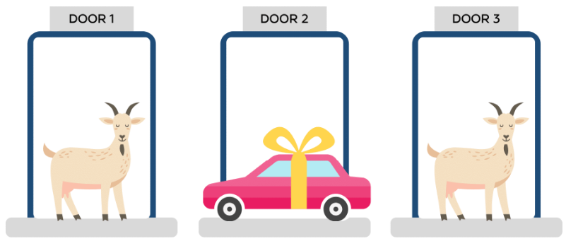

# Solving the Monty Hall problem with python code

The Monty Hall problem is a famous probability puzzle named after the host of the American television game show ["Let's Make a Deal,"](https://www.cbs.com/shows/lets_make_a_deal/) Monty Hall. The problem was first introduced in the early 1970s and gained widespread attention when it was published by Marilyn vos Savant in her "Ask Marilyn" column in Parade magazine in 1990. It has since stumped many mathematicians and sparked numerous debates and discussions.

!!! Info "Monty Hall scenario explained"
    The scenario presented in the Monty Hall problem is as follows: You are a contestant on a game show and are faced with three closed doors. Behind one of the doors is a valuable prize, such as a car, while the other two doors conceal less desirable prizes, like goats. Your objective is to select the door behind which the car is hidden.

<figure markdown>
  { width="500" }
  <figcaption>Monty Hall visualized</figcaption>
</figure>

<figure markdown>
  { width="500" }
  <figcaption>Monty Hall visualized</figcaption>
</figure>

Initially, you choose one door, let's say Door 1. Before revealing what is behind your chosen door, the host, Monty Hall, who knows what is behind each door, decides to add a twist to the game. He opens one of the other two doors, revealing a goat. Importantly, Monty will always choose a door that he knows conceals a goat, and he will never open the door you selected or the one with the car.

At this point, you are left with two unopened doors: your original choice, Door 1, and the other unopened door, let's say Door 2. Monty now gives you a new opportunity to change your selection from Door 1 to Door 2. The question then becomes: Should you stick with your original choice or switch to the other unopened door?

Intuitively, many people assume that since there are only two doors remaining, the probability of the car being behind each door is 1/2, making it irrelevant whether you switch or not. However, this intuition is incorrect.

In reality, the optimal strategy is to switch doors. Surprisingly, by switching, you increase your chances of winning the car to 2/3, while sticking with your original choice only gives you a 1/3 chance. This conclusion can be explained through probability calculations.

Initially, the probability of the car being behind any individual door is 1/3. When Monty reveals a goat behind one of the remaining doors, the probability distribution changes. The door you initially chose still has a 1/3 chance of hiding the car, but now the other unopened door has a 2/3 chance of being the winner. Switching to the other door doubles your chances of winning.

The Monty Hall problem has stumped mathematicians because the intuitive answer of a 1/2 chance seems logical at first glance. However, through careful analysis, it becomes clear that the optimal strategy involves switching doors. The problem challenges our intuitions about probability and illustrates how our instincts can sometimes lead us astray.

Solving the Monty Hall problem is important because it demonstrates the power of mathematical reasoning and highlights the importance of understanding probability. It serves as a valuable tool for teaching and learning about conditional probability, Bayesian reasoning, and the concept of information update.

In conclusion, the Monty Hall problem presents a fascinating probability puzzle that has confounded many mathematicians. By revealing the counterintuitive nature of the optimal strategy, it emphasizes the significance of logical reasoning and challenges our intuitions about probability.

```python
import numpy as np
import matplotlib.pyplot as plt

def pick(n):
    # print("Given list is:", n)
    picked = np.random.choice(n)
    return picked
    
def experiment(case = 2, n = 10000):
    count = 0
    history = []
    for i in range(n):
        choices = [0,1,2]
        actual_gift = pick(choices)
        user_picked = pick(choices)
        
        monty = choices.copy()
        
        if user_picked == actual_gift:
            monty.remove(user_picked)
            monty_show = pick(monty)
        else:
            monty_show1 = monty.copy()
            monty_show1.remove(user_picked)
            monty_show1.remove(actual_gift)
            monty_show = pick(monty_show1)
            
        if case == 1:
            if user_picked == actual_gift:
                count+=1
        else:
            choices.remove(user_picked)
            choices.remove(monty_show)
            # print(choices)
            if choices[0] == actual_gift:
                count+=1
                
        history.append(count/(i+1))
                
    return count/n, history

if __name__ == "__main__":
    ans, history = experiment(case=2, n= 100)
    ans1, history1 = experiment(case=1, n= 100)
    plt.plot(history)
    plt.plot(history1)
    plt.show()
    print(ans)
```
