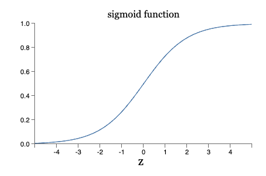

# LEARNING to make decisions
In the previous section, we looked at a basic perceptron model that takes in binary inputs $x_i$ and their corresponding weights $w_i$ and makes a binary decision between `Yes` or `No` (labelled `0` or `1`).  

However, we still cannot use the perceptron model because it is not **trained**. As the values for weights $w_i$ and bias $b$ are not optimal yet. **This is exactly what we will discuss in this chapter. Making Neural Networks learn.**

## Making Perceptron Learn

We have, with us a perceptron model, that makes binary decisions as follows:

Using `0` for YES and `1` for NO.

$$
\text{output } = \left\{ \begin{matrix}
\text{0 if } \sum_j x_j w_j + b \geq 0\\ 
\text{1 if } \sum_j x_j w_j + b < 0\\
\end{matrix}\right.
$$

The two parameters, above that control the output of the model are `weights` and `bias`. **Changing values of weights and biases changes the output of the model (perceptron).** If we would like to make an optimized models, we have to learn the optimal values of `weights` and `biases` for a given problem at hand for a given dataset.

In the above setting of perceptron we see that changing values of weights and bias can lead to any values on the real line output and with many features, slight changes in weights can lead to vast changes in the output, lets fix that using some function (called activation function) on top of the weighted output.

<!-- We need an **activation function** that could help our Perceptron model to: -->

!!! info "Why Activation Function?"
    1. Accept any input on the real number line (instead of just binary inputs).
    2. Make it possible that small changes to weights and bias would result in small changes to output so that we can come up with an algorithm to find the optimal values for $w_i$ and $b$.
    3. Scales the output of the perceptron between some values so that we can set an accept threshold along with the activation function.

## Sigmoid Activation

Sigmoid (also called Logistic) function takes any input on the real line and returns value between 0 to 1. This works really well for our model as we can be sure that, no matter what the weights are, we know that the output of our model will be between 0 to 1. **Importantly, this helps us to set a threshold of `0.5` to make decision.** This is a very commonly accepted threshold in the field of Deep Learning.


$$
\text{sigmoid(z)} = \sigma(z) = \frac{1}{1+e^{-z}}
$$

In our case, the perceptron output becomes

$$
\text{output} = \text{sigmoid} ( \sum_j x_jw_j +b)
$$

Adding our threshold of `0.5` into the equation

$$
\text{output } = \left\{ \begin{matrix}
\text{1 if } \sigma(\sum_j x_j w_j + b) \geq 0.5\\ 
\text{0 if } \sigma(\sum_j x_j w_j + b) < 0.5\\
\end{matrix}\right.
$$

The sigmoid activation preserves our initial intuition that largely positive values lead to one decision and largely negative values lead to another decision. This still holds true after applying the sigmoid activation function as largely positive numbers shall be scaled closer to `1` and negative numbers are scaled towards `0`.

!!! tip "But does using sigmoid function change the way perceptron is modeled?"
    Let's take a look at the Sigmoid curve. To make sure that an inequality is maintained before and after a function is applied, there are some checks required to be passed.

    1. The function must be monotonically increasing or decreasing.
    2. The function must be defined everywhere on the real number line.

    <figure markdown>
        
    </figure>

    From the above figure we see that sigmoid function satisfies these conditions, which means adding sigmoid function does not effect the perceptron decision making inequality.

    The crucial advantages of sigmoid activation:
    
    1. It gives a continuous, smooth function which leads to an important details that small changes in weights $\Delta w_j$ and bias $\Delta b$ will produce a small change in the output $\Delta \text{output}$. This detail is crucial that helps the sigmoid neuron (perceptron) learn.

    2. Sigmoid is differentiable throughout the number line. This is another crucial feature of sigmoid activation and shall be discussed in this chapter.

    $$
    \Delta \mbox{output} \approx \sum_j \frac{\partial \, \mbox{output}}{\partial w_j}
    \Delta w_j + \frac{\partial \, \mbox{output}}{\partial b} \Delta b,
    $$
    
    The above equation represents how the changes in output $\Delta \text{output}$ is a linear function of changes in weights $\Delta w_j$ and changes in bias $\Delta b$.

    This is derived from the equation:

    $$
    \text{output} = \text{sigmoid} ( \sum_j x_jw_j +b)
    $$

    This linear dependence makes it easy for us to make small changes in weights and attain changes in output. **This is what makes the learning possible.** In other words, we are setting stage for our perceptron to learn.

!!! question "Is Sigmoid the only activation function that makes learning possible?"
    Definitely not! Sigmoid activation function is one of the **many Activation Functions** present in the realm of Deep Learning. Even without the sigmoid activation, the perceptron can learn, however the learning would not be easier as changes in weights might drastically effect the output.

    Other Activation Functions:

    1. Softmax Activation
    2. ReLU Activation
    3. Leaky ReLU Activation
    
    and many more exist, but for now lets focus on the sigmoid function and make our first learning neural network.

## We have Sigmoid Neurons

1. We have a sigmoid neuron unit (a variant of perceptron) that takes in any inputs on number line and weights to make a binary decision.
2. Small changes to weights and bias makes small changes to output, this means we can come up with an algorithm to tune the values of $w_i$ and $b$ and find optimal values.(1)
    { .annotate }

    1. We still need a metric to denote what exactly optimal/good/bad means.

3. Sigmoid activation also allows us to set a threshold of `0.5` to make decisions between two classes (`0` and `1`)

<figure markdown>
{width="500"}
    <figcaption>Why Sigmoid?
    <a href = "http://neuralnetworksanddeeplearning.com/images/tikz8.png">Source</a>
    </figcaption>
</figure>

Sigmoid Neurons allows for the above architecture. We can stack up a bunch of sigmoid neurons as each of the neuron outputs a value between `0` and `1`. We can still use the threshold `0.5` for decision-making. This is wonderful for us because, **all we need now is a learning algorithm to tweak the values of weights, and a metric to denote how good/bad output weights are for a given dataset.**

## Neural Networks

Having understood the motivation and working of sigmoid neurons, we are now ready to understand a network of these artificial neurons as shown in the above figure, a Neural Network.

A Neural Network is a layered combination of artificial neurons (any activation function can be used to the output neurons to make a decision) as shown in the figure below. Each node is an artificial neuron and is connected to other neurons present at various LAYERS.

<figure markdown>
{width="500"}
    <figcaption>What is a Neural Network?
    <a href = "http://neuralnetworksanddeeplearning.com/images/tikz10.png">Source</a>
    </figcaption>
</figure>

!!! info "Why the network architecture?"
    If you remember from the previous section, we modeled a perceptron based on the binary features we used to make a decision. In the initial case, these features are just simple Yes or No questions. However, not all features are simple and precise. There could be complex, abstract, interdependent features that lead to a decision. Hence we need network that could handle these cases.

!!! question "Terminology"
    1. The first layer of a neural network like the above one is known as the **input layer**, as it takes inputs to the network (like the Dendrites in a biological neuron).
    2. The final layer that provides the output of a neural network is known as the **output layer**. This output layer could be connected to other networks. The output layer might contains one or more neurons (more on this later). For simplicity consider **one output neuron that makes a binary decision.** 
    2. The layers that come after the input layer and before the final output layer are known as the **hidden layers.**

    <figure markdown>
    {width="500"}
        <figcaption>Anatomy of a neural network
        <a href = "http://neuralnetworksanddeeplearning.com/images/tikz11.png">Source</a>
        </figcaption>
    </figure>

    **The above neural network is sometimes also known as a Multi-Layer Perceptron (MLP) or Feedforward Neural Networks as the information flow is in the left-to-right (forward) direction.**

## Coding FeedForward Neural Networks (without learning)

[](https://colab.research.google.com/drive/1DL4GgeAwFupdV8sgI4h0BPP9febwl-FK?usp=sharing) (Use ++ctrl++ + click to open in new tab)

<!-- <a href="https://colab.research.google.com/drive/1DL4GgeAwFupdV8sgI4h0BPP9febwl-FK?usp=sharing" target="_blank">
    
</a>(Opens in a new tab) -->


``` py
import numpy as np

class Perceptron:
    def __init__(self):
        self.weight = np.random.uniform(-1, 1) # 1 (To test the architecture)

    def activate(self, value):
        # Using the sigmoid activation function on every neuron
        return 1 / (1 + np.exp(-value)) # value (To test code correctness)

class Layer:
    def __init__(self, num_neurons):
        self.neurons = [Perceptron() for _ in range(num_neurons)]

    def feedforward(self, inputs):
        neuron_values = []
        for neuron in self.neurons:
          value = 0
          for i in inputs:
            value+= i*neuron.weight
          neuron_values.append(neuron.activate(value))
        return neuron_values            


class NeuralNetwork:
    def __init__(self, num_inputs, hidden_layers, num_outputs):
        self.layers = []

        # Input layer
        self.layers.append(Layer(num_inputs))

        # Hidden layers
        for i in hidden_layers:
            self.layers.append(Layer(i))

        # Output layer
        self.layers.append(Layer(num_outputs))

    def feedforward(self, inputs):
        for layer in self.layers[1:]: # we dont want to compute values again for inputs as we already have them.
            inputs = layer.feedforward(inputs)
        return inputs

# Define the network
num_inputs = 4
hidden_layers = [5, 4, 3, 2]
num_outputs = 1

network = NeuralNetwork(num_inputs, hidden_layers, num_outputs)

# Input values
inputs = [1, 2, 3, 4]

# Get the output
output = network.feedforward(inputs)[0]
print(output)
print(1 if output>=0.5 else 0)
```
**But where did the bias go?**
Every perceptron node comes with a corresponding bias as discussed before. However, most literature ignores bias (or incorporates this variable within the weight) as with an without bias the output of neuron after activation (sigmoid for example) falls within a range.

Hence to remove extra learnable paramters, bias is incorporated into the weight itself and the challenge boils down to finding the optimal weights of each neuron.

If you still want to explicitly maintain a bias term, the perceptron class and Layer class can be changed to

```py
class Perceptron:
    def __init__(self):
        self.weight = np.random.uniform(-1, 1)
        self.bias = np.random.uniform(-1, 1)  # Initialize bias

    def activate(self, value):
        return 1 / (1 + np.exp(-value))  # Sigmoid activation

# Layer class
value+= i*neuron.weight + neuron.bias
```

The above code implements a basic feedforward neural network without any learning component. This is a great place to start. All we want now is an **algorithm** to find the optimal values for weights to make decisions on **unseen data points**.

## Let's make a Neural Network Learn.

1. We have a neural network that accepts inputs.
2. Hidden layers calculate weighted sum to transmit information.
3. We have an activation function for each neuron.
4. Each neuron has a weight and the optimal values of these weights have to be learnt.

$$
\text{output } (y_i) = \text{sigmoid}(\sum_j x_jw_j+b)
$$

!!! quote "ANNs"
    Artificial Neural Networks and Deep Learning models learn from a bunch of examples.

### The beauty of Neural Networks.

If you didn't realize, the neural networks are built in this way to facilitate learning from examples.

1. First we define a task at hand (such as image recognition).
2. We collect data for the task that has a bunch of data points and their corresponding ground truth output. Think in terms of math that we will have $x_i$ and $\text{output}$ for each data point.
3. We randomly initialize weights of each neuron in the network and make predictions (random predictions which are intially very wrong).
4. We define a metric that helps us understand the correctness of neural network predictions.
5. We use an **algorithm** that tunes the values of weights of neurons in neural network such that the correctness in prediction of our network is maximized. This algorithm is the learning process of the network (also known as training).
6. Upon training, we will have the optimal values for all the weights $w_i$. 
7. These weights are then used to predict values for unseen inputs using our trained model.


    


    